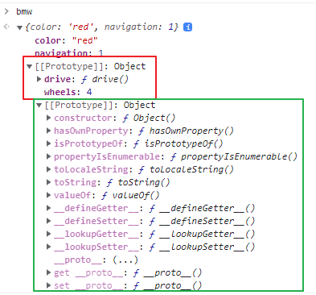

# [Javascript] - 14.[중급]상속 프로토타입

* ___상속___
  - 객체.__proto__ = 상위 객체
  - 상위 객체의 property를 상속받아 사용 할 수 있다.
  - 상속받은 객체를 상속받을 수 있다.(prototype chain)
    ```javascript
    const car = {
	    wheels : 4,
	    drive() {
		   console.log("drive..");
	    }
    }

    const bmw = {
  	  color: "red",
	    navigation:1,
    }

    const x5 = {
	    color : "white",
	    name : "x5",
    }

    bmw.__proto__ = car;
    x5.__proto__ = bmw; // 상속받은 객체를 상속받을 수 있다. Prototype Chain
    // x5.__proto__ = bmw.__proto__ = car; 이런 형태로 사용은 안됨.
    ```
  - 다중 상속은 안된다.
    ```javascript
    const car = {
	    wheels : 4,
	    drive() {
	    	console.log("drive..");
	    }
    }

    const airplane = {
	    wings : 2,
	    fly() {
		    console.log("fly..");
	    }
    }

    const x6 = {
	    color: "red",
	    name : "x6",
    }

    x6.__proto__ = car;
    x6.__proto__ = airplane;
    // x6는 최종적으로 airplane만 상속받는다.
    ```
  - hasOwnProperty() 자신이 직접 정의한 property 여부 반환
    ```javascript
    for( p in x5) {
	    if( x5.hasOwnProperty(p) ) {
		    console.log('직접 정의한 property : ', p);
	    } else{
		    console.log('상속받은 property : ', p);
	    }
    }
    ```
  

* ___prototype___
  - 생성자 함수를 이용한 상속 처리.
    ```javascript
    const car = {
	    wheels : 4,
	    drive() {
		    console.log("drive..");
	    }
    };

    const Bmw = function(color) {
	    this.color = color;
    }

    /*/// 매번 새로운 하위 객제 생성시 __proto__를 이용해서 car를 상속받아야 한다.
    const x5 = new Bmw("red");
    const z4 = new Bmw("blue");
    x5.__proto__ = car;
    z4.__proto__ = car;

    /*/// 생성자 함수 이용할때는 prototype 을 활용하여 중복코드(car 상속)를 제거할 수 있다.
    Bmw.prototype.wheels = 4;
    Bmw.prototype.drive = function() {
		  console.log("drive..");
    }

    const x5 = new Bmw("red");
    const z4 = new Bmw("blue");
    const e6 = new Bmw("black");
    //*///

    console.log(z4 instanceof Bmw); // true
    console.log(z4.constructor === Bmw); // true
    ```
  - Closer를 활용.
    - 객체의 설정값(property)을 아무때나 바꿀수 있다.
    - readonly 처리.
      ```javascript
      const Bmw = function(color) {
	      this.color = color;
      }
      const x5 = new Bmw("red");
      x5.color = "black"; // 값을 바꿀 수 있다.

      const Bmw = function(color) {
	      const c = color;
	      this.getColor = function() { // closer 활용
		      console.log(c);
	      };
      };

      const x5 = new Bmw("red");
      x5.getColor(); // readonly 만 가능함.
      ```