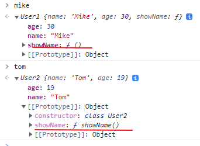

# [Javascript] - 15.[중급]클래스

* ___클래스___
  - 비슷한 객체를 생성하기 위해서 사용.
  - 생성자 함수와 유사하지만 ES6에 추가된 스펙.
  - 생성자 함수와 사용법은 동일하다.
  - 생성자 함수와 다른점은 내부에 정의된 함수가 proto로 정의된다. 
  - class 는 반드시 new 키워드를 사용해서 선언해야 한다.(type error 발생)
    ```javascript

    // 생성자 함수 사용.
    const User1 = function(name, age) {
	    this.name = name;
	    this.age = age;
	    this.showName = function() {
		    console.log(this.name);
	    }
    ;}

    const mike = new User1("Mike", 30); // new 키워드를 생략해도 오류발생 안함.
    mike.showName();

    // 클래스 사용
    class User2 {
	  // 생성자 함수
	    constructor(name, age) {
		    this.name = name;
		    this.age = age;
	    }
	    showName() {
		    console.log(this.name);
	    }
    };
 
    const tom = new User2("Tom", 19); // 반드시 new키워드 사용.
    tom.showName();
    ```
    

  - 클래스 상속
    ```javascript
    class Car {
	    constructor(color) {
		    this.color = color;
		    this.wheels =4;
	    }
	
	    drive() {
		    console.log("drive..");
	    }
    }

    // extends 키워드 사용.
    class Bmw extends Car {
	    // 생성자 overriding
	    constructor(color) {
		    super(color); // 생성자에서는 반드시 부모생성자를 호출해야한다.
		    this.navigation = 1;
	    }
  
      // 부모에 정의 안된 함수 추가
	    park() {
		    console.log("Park");
	    }
	
	    // method overriding
	    drive() {
		    super.drive(); // 부모의 drive() 함수를 사용.
		    console.log("Bmw drive..");
	    }
    };
  
    const z4 = new Bmw("blue");
    z4.drive();
    z4.park();
    ```